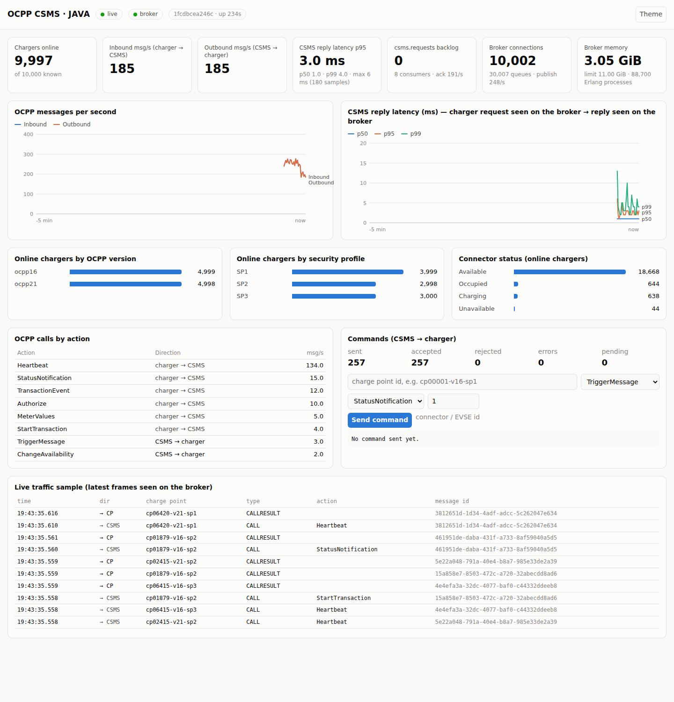
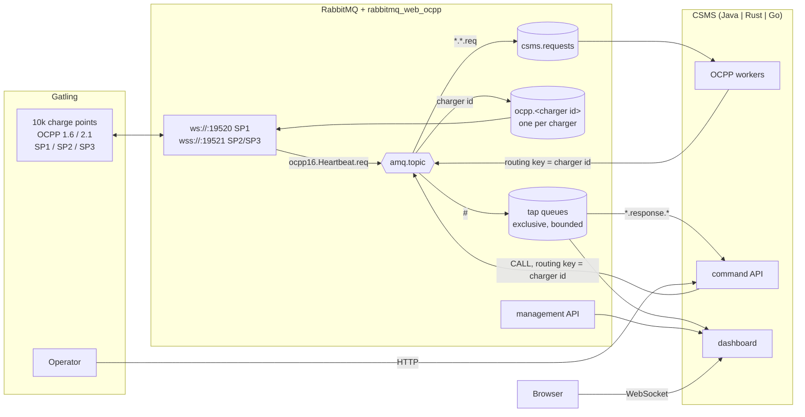

# Polyglot OCPP CSMS demo: Java vs Rust vs Go

The same Charging Station Management System (CSMS) backend written three times, each in the
style that fits its ecosystem, all behind **rabbitmq-web-ocpp**, and load tested with
**Gatling** simulating **10,000 charge points**:

| | Java | Rust | Go |
|---|---|---|---|
| Shape | Modular monolith | Single async binary | Three microservices |
| Stack | Spring Boot 4.1, Spring AMQP, Spring MVC + WebSocket, virtual threads | tokio, lapin 4, axum 0.8 | stdlib `net/http`, amqp091-go, coder/websocket |
| Units | `ocpp`, `command`, `monitor`, `dashboard` packages | tasks sharing one `App` | `ocpp-worker`, `command-api`, `dashboard` (one image) |
| Scales by | replicas of the whole app | replicas of the whole app | each service on its own (`csms-go-worker` runs ×2) |
| Code (non-blank lines, without tests) | ~970 | ~1,330 | ~1,320 |
| Dashboard | <http://localhost:8081> | <http://localhost:8082> | <http://localhost:8083> |

Each implementation does three things:

* **answers charger-initiated calls** for OCPP 1.6 and 2.x (BootNotification, Heartbeat,
  StatusNotification, MeterValues, Authorize, Start/StopTransaction, TransactionEvent, ...)
* **offers a command API** for `TriggerMessage`, `ChangeAvailability` and `Reset`, which waits for
  the charger's answer
* **serves a live dashboard** fed only by RabbitMQ: a tap on the OCPP traffic plus the management
  API, pushed to the browser over a WebSocket every second

The fleet is a mix of **OCPP 1.6 and 2.1** chargers over **Security Profiles 1, 2 and 3**.



## Architecture



1. A charger frame enters the plugin and is published to `amq.topic` with routing key
   `<protocol>.<Action>.<req|conf|error>` (`ocpp16.BootNotification.req`), `reply_to` = charge point
   id and `correlation_id` = OCPP message id.
2. CALLs land in the shared, durable **`csms.requests`** queue (binding `*.*.req`). Workers compete
   for it, build the CALLRESULT and publish it to `amq.topic` with the **charge point id as routing
   key**. The plugin's per-charger queue `ocpp.<id>` delivers it down the right WebSocket, on
   whichever node the charger is connected to.
3. Commands go the same way in reverse: the API publishes a CALL to the charge point id and waits.
   The charger's CALLRESULT comes back as `ocpp21.response.conf` with the message id as
   correlation id.
4. Each instance declares an exclusive, auto-deleted, length-bounded (`x-max-length` 50k,
   `drop-head`) **tap queue** bound to `#`: a copy of all OCPP traffic of its vhost. From it, the
   CSMS learns which chargers are online and on which protocol (no database), measures the **reply
   latency** (request seen on the broker → answer seen on the broker) and counts commands.
5. When a charger disconnects, the plugin publishes a synthetic `StatusNotification`
   (`vendorErrorCode: "Offline"`). The workers recognise it and do not answer; the registry marks
   the charger offline.

Each implementation lives in its own vhost (`csms-java`, `csms-rust`, `csms-go`), so all three
can run side by side against one broker and be compared on the same fleet.

### Why these shapes

* **Java, modular monolith.** Spring Boot's strength is wiring many concerns in one process:
  `@RabbitListener` workers, a REST controller, a WebSocket handler and `@Scheduled` pollers share
  beans (registry, statistics, gateway). With virtual threads, the command API simply blocks on a
  `CompletableFuture` while waiting for the charger. Packages keep the seams that a split would
  need.
* **Rust, one async binary.** tokio makes "many independent loops" cheap: N worker tasks with their
  own channel, a tap task, a poller, a snapshot ticker and the axum server all share an `Arc<App>`
  with short `Mutex` sections. One 6 MB binary, no runtime.
* **Go, microservices.** Small static binaries, fast start and the standard library's HTTP server
  make per-service deployment the natural fit. The worker scales independently of the API, and the
  dashboard is the single entry point (it reverse-proxies `/api/`). Shared code sits in
  `internal/`, built once into one image.

Recovery strategy also differs on purpose: Spring AMQP reconnects by itself, while the Rust and Go
services exit on connection loss and let the container restart them with a clean state.

## Quick start

Prerequisites: Docker with Compose v2, ~8 GB RAM for the full 10k run (less for smaller fleets).

```bash
cd examples/polyglot-demo

# 1. Broker + one CSMS (java, rust or go; several --profile flags start several)
docker compose --profile java up -d --build

# 2. Open the dashboard: http://localhost:8081 (Java), 8082 (Rust), 8083 (Go)
#    RabbitMQ management: http://localhost:15672 (csms / csms)

# 3. Unleash the fleet against it (reports in ./gatling/results)
TARGET=java docker compose run --rm gatling
```

The first `up` runs the **provision** service, which generates into `./generated` (in about a
second): 10,000 chargers with their passwords, a CA, the broker certificate, 3,000 client
certificates and the RabbitMQ definitions with one user per charger. The broker imports them at
boot (about 20 s for 10k users × 3 vhosts).

Smaller run, e.g. on a laptop:

```bash
TARGET=go GATLING_CHARGERS=2000 RAMP_SECONDS=30 DURATION_SECONDS=300 docker compose run --rm gatling
```

Raise the load without more chargers by lowering the heartbeat interval the CSMS hands out:

```bash
HEARTBEAT_INTERVAL=10 docker compose --profile java up -d   # ~1,000 heartbeats/s for 10k chargers
```

Clean up with `docker compose --profile java --profile rust --profile go down -v`.

## The fleet

Generated by [`provision`](provision/main.go), deterministic for a given seed:

| Share | Version | Security Profile | How it connects |
|---|---|---|---|
| 50% | OCPP 1.6 (`ocpp1.6`) | | |
| 50% | OCPP 2.1 (`ocpp2.1`) | | |
| 40% | | **1**: Basic auth, no TLS | `ws://rabbitmq:19520/ocpp/<vhost>/<id>`, `Authorization: Basic id:password` |
| 30% | | **2**: TLS + Basic auth | `wss://rabbitmq:19521/...`, server certificate from the demo CA |
| 30% | | **3**: mutual TLS | `wss://rabbitmq:19521/...`, client certificate with `CN=<id>`, no password |

Charge point ids encode version and profile (`cp00042-v21-sp3`), so the dashboards can break the
fleet down without a side channel. Change the mix with `CHARGERS`, `OCPP21_PCT`, `SP1_PCT`,
`SP2_PCT`, `SP3_PCT` on `docker compose up` (the provision step only regenerates when they
change).

How the broker enforces the profiles ([`rabbitmq/rabbitmq.conf`](rabbitmq/rabbitmq.conf)):

* every charger is a RabbitMQ user named after its id; passwords are 40 hex characters (the OCPP
  AuthorizationKey format), stored as salted SHA-256 hashes in the definitions
* users of Profiles 2 and 3 are tagged **`tlsonly`**, so the plugin refuses them on the plain
  listener: no downgrade from SP2/SP3 to SP1
* the TLS listener requests a client certificate (`verify_peer`) without requiring one
  (`fail_if_no_peer_cert = false`); with `ssl_cert_login_from = common_name` a certificate's CN
  becomes the login and must equal the id in the URL
* **topic permissions** pin each charger to its identity: it may only bind its queue with its own
  id (`read: ^{client_id}$`) and only publish OCPP routing keys

## Implementation contract

All three implementations honour the same contract, so the dashboard page, the Gatling simulation
and this README are shared.

### Configuration (environment)

| Variable | Default | |
|---|---|---|
| `RABBITMQ_HOST` / `RABBITMQ_PORT` | `localhost` / `5672` | |
| `RABBITMQ_USER` / `RABBITMQ_PASS` | `csms` / `csms` | AMQP and management API |
| `RABBITMQ_VHOST` | `csms-<impl>` | |
| `RABBITMQ_MANAGEMENT_URL` | `http://localhost:15672` | |
| `HTTP_PORT` | `8080` | |
| `HEARTBEAT_INTERVAL` | `60` | seconds, returned in BootNotification |
| `PREFETCH` | `200` | per worker consumer |
| `WORKER_CONCURRENCY` | `8` | worker consumers per process |
| `COMMAND_TIMEOUT_MS` | `15000` | also the command message TTL |
| `COMMAND_API_URL` | `http://localhost:8081` | Go dashboard only |

### Command API

| Method | Path | Body (all optional) |
|---|---|---|
| `GET` | `/api/chargers?limit=100` | online chargers first |
| `GET` | `/api/chargers/{id}` | |
| `POST` | `/api/chargers/{id}/trigger-message` | `{"requestedMessage": "StatusNotification" \| "Heartbeat" \| "BootNotification" \| "MeterValues", "connectorId": 1}` |
| `POST` | `/api/chargers/{id}/change-availability` | `{"type": "Inoperative" \| "Operative", "connectorId": 0}` |
| `POST` | `/api/chargers/{id}/reset` | `{"type": "Soft" \| "Hard"}` |

The request is version neutral and translated per protocol: for OCPP 2.x `connectorId` becomes
`evse.id`, `Reset` `Soft`/`Hard` becomes `OnIdle`/`Immediate`, `ChangeAvailability` uses
`operationalStatus`. Add `"ocppVersion": "ocpp16" | "ocpp201" | "ocpp21"` to target a charger the
instance has not seen yet.

```bash
curl -s -XPOST localhost:8081/api/chargers/cp00001-v16-sp1/reset -d '{"type":"Hard"}' -H 'content-type: application/json'
```
```json
{"chargerId":"cp00001-v16-sp1","action":"Reset","ocppVersion":"ocpp16","request":{"type":"Hard"},
 "messageId":"2a4f1141-…","latencyMs":3,"status":"Accepted","response":{"status":"Accepted"}}
```

Status codes: `200` answered with CALLRESULT, `400` invalid body, `404` unknown charger, `409`
charger offline, `502` answered with CALLERROR, `504` no answer in time.

### Dashboard snapshot (`GET /ws`, one text frame per second)

```jsonc
{
  "implementation": "rust", "instance": "…", "uptimeSeconds": 42, "timestamp": 1791225205927,
  "chargers": { "known": 10000, "online": 9998,
                "byVersion": { "ocpp16": 4999, "ocpp21": 4999 },
                "bySecurityProfile": { "1": 3999, "2": 3000, "3": 2999 } },
  "connectors": { "Available": 13020, "Charging": 3410, "Occupied": 3440, "Unavailable": 126 },
  "traffic": { "inPerSec": 260.0, "outPerSec": 262.0,
               "byAction": [ { "action": "Heartbeat", "direction": "in", "perSec": 166.0 } ] },
  "latency": { "samples": 255, "p50": 1.0, "p95": 3.0, "p99": 6.0, "max": 12.0 },
  "commands": { "sent": 120, "accepted": 118, "rejected": 0, "failed": 0, "pending": 2 },
  "broker": { "available": true, "connections": 10004, "queues": 10006, "publishRate": 520.0,
              "deliverRate": 1040.0, "requestQueue": { "messages": 0, "consumers": 8, "ackRate": 258.0 },
              "memoryBytes": 2147483648, "memoryLimitBytes": 11813557862,
              "fdUsed": 10050, "fdTotal": 65536, "erlangProcesses": 31000 },
  "recent": [ { "ts": 1791225205927, "direction": "in", "chargerId": "cp00001-v16-sp1",
                "kind": "CALL", "action": "Heartbeat", "messageId": "…" } ]
}
```

Rates and latency percentiles cover the last second. `connectors` and the charger breakdowns only
count online chargers.

## The load test

[`gatling/`](gatling) is a Gatling 3.16 Java project with two scenarios:

**Charge points** — one virtual user per charger, ramped over `RAMP_SECONDS`:

* connects with its own subprotocol, URL and credentials; Profile 3 users present their own client
  certificate through `perUserKeyManagerFactory`
* boots, reports its connectors, heartbeats at the interval the CSMS returned, and runs charging
  sessions (1.6: Authorize / StartTransaction / MeterValues / StopTransaction; 2.1: Authorize /
  TransactionEvent Started / Updated / Ended) with StatusNotifications in between
* **answers CSMS commands**: `autoReplyTextFrame` returns the CALLRESULT the instant a CALL arrives,
  in any state; each 1-second tick then applies the side effects (`Reset` → stop the session, close,
  reboot after 5-15 s; `ChangeAvailability` → status Unavailable/Available; `TriggerMessage` → send
  the requested message)
* behaves like firmware on failure: a refused connection, a dropped socket or an unanswered CALL
  closes the connection and retries

Every CALL is reported as `"<version> <Action>"` (e.g. `2.1 TransactionEvent`) with the time from
the frame leaving the charger to the CSMS answer arriving back **through the broker**: the main
figure to compare implementations. The `send <Action>` and `<version> connect SP<n>` lines count
frames sent and connection setup times.

**Operator** — starts after the ramp and calls the command API at `COMMANDS_PER_SEC`: 60%
TriggerMessage, 30% ChangeAvailability, 10% Reset, on random chargers. `409` (charger rebooting) is
an accepted answer. These requests (`API <command>`) measure the full command round trip:
HTTP → CSMS → broker → charger → broker → CSMS → HTTP.

| Variable | Default | |
|---|---|---|
| `TARGET` | `java` | picks vhost `csms-<target>` and API `http://csms-<target>:8080` |
| `GATLING_CHARGERS` | `0` (all) | use only the first N chargers of the fleet |
| `RAMP_SECONDS` | `120` | |
| `DURATION_SECONDS` | `600` | steady state after the ramp; then every charger disconnects |
| `COMMANDS_PER_SEC` | `2` | operator rate |
| `GATLING_HEAP` | `4g` | |

Further knobs are environment variables of the simulation: `CONNECTORS` (2),
`METER_INTERVAL_SECONDS` (60), `CALL_TIMEOUT_SECONDS` (60), `IDLE_MIN/MAX_SECONDS` and
`SESSION_MIN/MAX_SECONDS` (charging behaviour). Running outside Docker:

```bash
cd gatling
DATA_DIR=../generated TARGET_HOST=localhost VHOST=csms-rust CSMS_API=http://localhost:8082 \
  CHARGERS=500 RAMP_SECONDS=20 DURATION_SECONDS=120 mvn gatling:test
```

### Sizing

* 10k connections need file descriptors on both sides: the compose file sets `nofile` to 65536
  (override with `NOFILE` if your Docker host caps it lower).
* RabbitMQ holds one Erlang process, one queue and a few KiB per charger: expect 1-3 GB.
* Gatling with 10k WebSockets and 3k TLS client contexts fits in the default 4 GB heap.
* The first minute of a 10k ramp is TLS-handshake heavy; a longer `RAMP_SECONDS` smooths it.

### Reference run

One 4 vCPU / 16 GB VM running everything (broker, Gatling and the CSMSs), full fleet of 10,000
chargers, `RAMP_SECONDS=180 DURATION_SECONDS=300 COMMANDS_PER_SEC=5`, heartbeat interval 60 s
(≈ 280 OCPP messages/s in each direction at steady state, plus the 10k connects of the ramp):

| | Java | Rust | Go |
|---|---|---|---|
| Gatling requests / failures | 250,262 / 0 | 250,968 / 0 | 250,318 / 0 |
| 1.6 Heartbeat p50 / p95 / p99 (ms) | 2 / 4 / 9 | 2 / 6 / 13 | 2 / 5 / 10 |
| 1.6 BootNotification p95 / p99 (ms) | 11 / 81 | 11 / 23 | 12 / 23 |
| API trigger-message p95 (ms, full round trip) | 8 | 5 | 7 |
| CSMS CPU / memory at steady state | ~13 % / 250 MB | ~10 % / 21 MB | ~19 % / 45 MB (4 processes) |
| Image size (compressed) | 142 MB | 31 MB | 12 MB |

Round trips are measured by Gatling through the broker, so at this rate they mostly reflect
RabbitMQ and the shared host rather than the CSMS. The interesting differences are footprint and
how each runtime behaves when you push it: lower `HEARTBEAT_INTERVAL` (e.g. 5 s ≈ 2,000 msg/s) or
give the CSMS container a CPU limit and watch the `csms.requests` backlog and the latency chart.

## Demo script

1. `docker compose --profile java --profile rust --profile go up -d --build` and open the three
   dashboards side by side. Point out the management UI's *Connections* tab later: every charger
   shows up as a `WS OCPP` / `WSS OCPP` connection with its client properties.
2. `TARGET=java docker compose run --rm gatling`: watch chargers come online, the split by version
   and security profile, connector statuses moving as sessions start and stop, and the reply
   latency.
3. Use the dashboard form (or `curl`) to send `Reset Hard` to a charger: the CALL/CALLRESULT pair
   shows up in the live traffic sample, the charger drops offline (the plugin's synthetic offline
   notification), and boots again 5-15 s later.
4. Show that the worker is just a queue consumer: `docker compose up -d --scale csms-go-worker=4`
   and look at the consumer count of `csms.requests`, or stop the workers for a minute and watch the
   backlog build up and drain without chargers losing their connection.
5. Repeat with `TARGET=rust` and `TARGET=go`, then compare the Gatling reports in
   `gatling/results` (per-version, per-action round trip percentiles) and the code (see the line
   counts above).

## Layout

```
dashboard/index.html   shared dashboard page (no dependencies)
docker-compose.yml     broker, provision, the three CSMSs (profiles), gatling
gatling/               Gatling simulation: Fleet, ChargerModel (behaviour), ChargePointSimulation
go/                    cmd/{ocpp-worker,command-api,dashboard}, internal/{ocpp,rmq,monitor,broker,env}
java/                  demo.csms.{ocpp,command,monitor,dashboard,config}
provision/             fleet, definitions and PKI generator (Go, standard library only)
rabbitmq/rabbitmq.conf listeners, TLS and security profile settings
rust/                  src/{main,amqp,ocpp,commands,monitor,broker,dashboard,config}.rs
```

## Notes and limits

* This is a demo of the integration pattern, not a full CSMS: no persistence, no authorization of
  id tags, no smart charging. Answers are always `Accepted`.
* Workers publish answers without publisher confirms and acknowledge the request afterwards, in all
  three implementations (at-least-once from the queue's point of view, fire-and-forget for the
  reply).
* Answers to chargers carry a 60 s TTL and commands a TTL equal to the command timeout, so nothing
  stale reaches a charger that reconnects later.
* Gatling trusts any server certificate (its default); the charge points' identities are still
  verified by the broker.
* While a simulated charger awaits the answer to its own CALL, Gatling does not buffer other
  frames, so the *side effects* of a command arriving in those few milliseconds are skipped. The
  answer itself is always sent.
